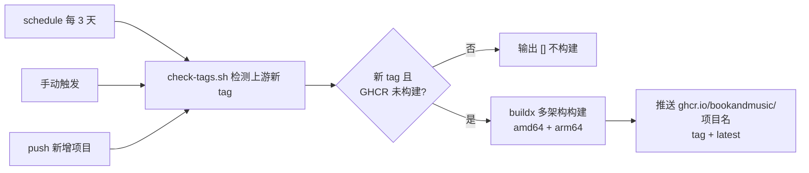
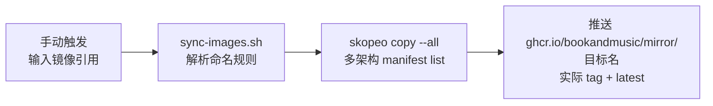

# image-hub 开发文档

面向仓库维护者：理解流水线如何工作、如何新增镜像项目、如何本地验证。镜像使用说明见根目录 [README.md](README.md)。

## 目录结构

```
image-hub/
├── .github/workflows/
│   ├── docker-build.yml   # 构建流水线：检测上游新 tag / 手动触发 / 新增项目
│   └── docker-sync.yml    # 同步流水线：手动输入镜像引用同步到 GHCR
├── projects/
│   └── <项目名>/          # 每个含 Dockerfile 的一级目录 = 一个镜像（目录名 = 镜像名）
│       ├── Dockerfile     # 必填；声明 ARG UPSTREAM_REPO / UPSTREAM_REF
│       └── README.md      # 该项目镜像的使用说明（运行方式、环境变量、持久化）
├── scripts/
│   ├── check-tags.sh      # 检测上游新 tag，输出构建矩阵（供 docker-build.yml 使用）
│   └── sync-images.sh     # 解析镜像引用并 skopeo 同步（供 docker-sync.yml 使用）
├── README.md              # 使用者文档（概述）
└── DEVELOPMENT.md         # 本文档
```

## 工作原理

### 构建链路



### 同步链路



## 构建流水线

### 新增项目

1. `mkdir -p projects/<项目名>`，放入 `projects/<项目名>/Dockerfile`。
2. Dockerfile 顶部声明构建参数（`check-tags.sh` 据此查询上游）：

   ```dockerfile
   ARG UPSTREAM_REPO=https://github.com/<owner>/<repo>  # 必填：上游仓库地址，用于检测新 tag
   ARG UPSTREAM_REF=main                                # 可选：默认分支或 tag
   ```

   构建时按 `UPSTREAM_REPO` / `UPSTREAM_REF` 拉取上游源码。上游自带可用 Dockerfile 时用上游的；没有或不可用时由本仓库提供。
3. 可选：在 `projects/<项目名>/README.md` 编写该镜像的使用说明，并在根 README 的「支持的镜像」表登记一行。

### 触发方式

| 触发方式 | 说明 |
|---|---|
| 上游新 tag | 每 3 天自动检测一次；上游出现新版本 tag 且 GHCR 尚无该 tag 时才构建 |
| 手动触发 | Actions 界面运行 Docker Build，输入项目名，构建该项目当前 commit |
| 新增项目 | push 首次添加 `projects/<项目名>/` 时自动构建 |

### 镜像标签

| 触发来源 | 镜像 tag |
|---|---|
| 上游新 tag | `<上游tag>` + `latest` |
| 手动触发 / 首次构建 | `<上游commit前8位>` + `latest` |

已构建过的 tag 自动跳过：直接查询 GHCR 实际镜像 tag 判断，无需维护状态文件。

## 同步流水线

- 触发：仅手动（Actions 界面运行 Docker Sync），`images` 输入框填镜像引用，逗号分隔多个。
- 每个输入同步两个标签：`<实际tag>` + `latest`；`skopeo copy --all` 保留多架构 manifest list。
- 命名规则（详见根 README「同步镜像」）：官方 library 不加前缀，`user/app` 合并为 `user-app`，目标统一在 `mirror/` 前缀下。
- 已同步过的版本自动跳过：同步前查询 GHCR 目标镜像实际 tag 判断。

## 配置

无需任何 Secrets：`GITHUB_TOKEN` 由 GitHub 自动提供（工作流已声明 `packages: write` 权限），GHCR 登录、tag 跳过判断、镜像推送全部复用同一 token。

## 本地验证

```bash
bash -n scripts/*.sh              # 脚本语法检查
bash scripts/check-tags.sh        # 查看当前会触发构建的项目（需网络）
DRY_RUN=1 GHCR_OWNER=test bash scripts/sync-images.sh "nginx:1.21, user/app:2.0"   # 查看同步计划
```