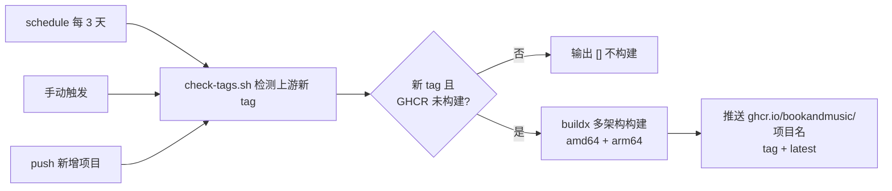
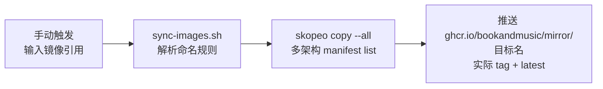

<div align="center">

# image-hub

*为开源项目构建镜像并分发到 GHCR；手动同步 Docker Hub 公开镜像作为备用源*

[](LICENSE)
[](https://github.com/bookandmusic/image-hub/actions/workflows/docker-build.yml)

⭐ 如果这个项目对你有帮助，欢迎 Star！

[功能特性](#功能特性) • [构建镜像](#构建镜像) • [同步镜像](#同步镜像) • [开发文档](DEVELOPMENT.md)

</div>

image-hub 是一个基于 GitHub Actions 的镜像分发仓库：为没有官方镜像的开源项目自动构建镜像并推送到 GHCR，同时支持把 Docker Hub 的公开镜像手动同步到 GHCR 作为备用镜像源。构建与同步是两条独立流水线，互不干扰。

## 功能特性

- 🏗️ **目录即项目** — `projects/` 下每个含 `Dockerfile` 的一级子目录就是一个项目，目录名 = 镜像名，新增项目无需改任何配置。
- 🏷️ **上游 tag 检测** — 上游发布新版本 tag 时自动构建；已构建过的 tag 自动跳过（直接查询 GHCR 实际镜像 tag，无需维护状态文件）。
- 🖥️ **多架构镜像** — 每次构建同时产出 `linux/amd64` 与 `linux/arm64`（Buildx + QEMU）。
- 🔄 **一键同步** — 无需维护同步列表，在 CI 界面输入镜像引用即同步，多架构 + 实际 tag + `latest` 双标签。
- 🧩 **自备 Dockerfile** — 上游有可用 Dockerfile 就用上游的；没有或不可用时由本仓库提供（见[构建镜像](#构建镜像)）。

## 构建镜像

为没有官方镜像的开源项目自动构建并分发到 GHCR。在 GitHub Actions 界面运行 **Docker Build**，输入项目名即可构建该项目当前 commit；也可以什么都不做，等上游新 tag 每 3 天自动检测触发。

### 支持的镜像

| 镜像 | 原始仓库 | 当前镜像 |
|---|---|---|
| [server-services-manager](projects/server-services-manager/README.md) | [samosa-ai-com/server-services-manager](https://github.com/samosa-ai-com/server-services-manager) | `ghcr.io/bookandmusic/server-services-manager:latest` |

> [!NOTE]
> 每个镜像的详细使用说明（运行方式、环境变量、数据持久化等）见对应项目目录下的 `README.md`，从上方「镜像」列链接进入。

### 构建流程



新增项目、触发方式与镜像标签规则见 [DEVELOPMENT.md](DEVELOPMENT.md#构建流水线)。

## 同步镜像

把 Docker Hub 的公开镜像同步到 GHCR 作为备用镜像源。在 GitHub Actions 界面运行 **Docker Sync**，在 `images` 输入框填入镜像引用（逗号分隔多个）：

```bash
nginx:1.21, docker.io/bitnami/kafka:3.7.0
```

每个输入同步两个标签：`<实际tag>` 和 `latest`，多架构保留 manifest list。目标位于 `ghcr.io/bookandmusic/mirror/` 下，命名规则：

| 输入 | 目标 |
|---|---|
| `nginx:1.21` | `mirror/nginx:1.21`（官方 library 不加前缀） |
| `docker.io/nginx:1.21` | `mirror/nginx:1.21` |
| `user/app:2.0` | `mirror/user-app:2.0`（用户名拼到名字上） |
| `docker.io/user/app:2.0` | `mirror/user-app:2.0` |

> [!TIP]
> 同步只支持公开镜像（匿名拉取 Docker Hub），无需任何凭据配置。



已同步过的版本自动跳过，详细流程见 [DEVELOPMENT.md](DEVELOPMENT.md#同步流水线)。

## 开发

仓库维护相关内容（目录结构、新增项目、配置、本地验证）见 [DEVELOPMENT.md](DEVELOPMENT.md)。
